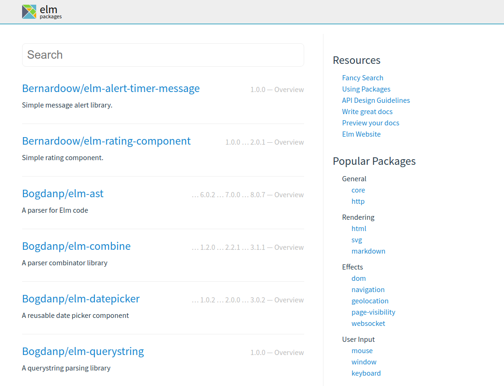
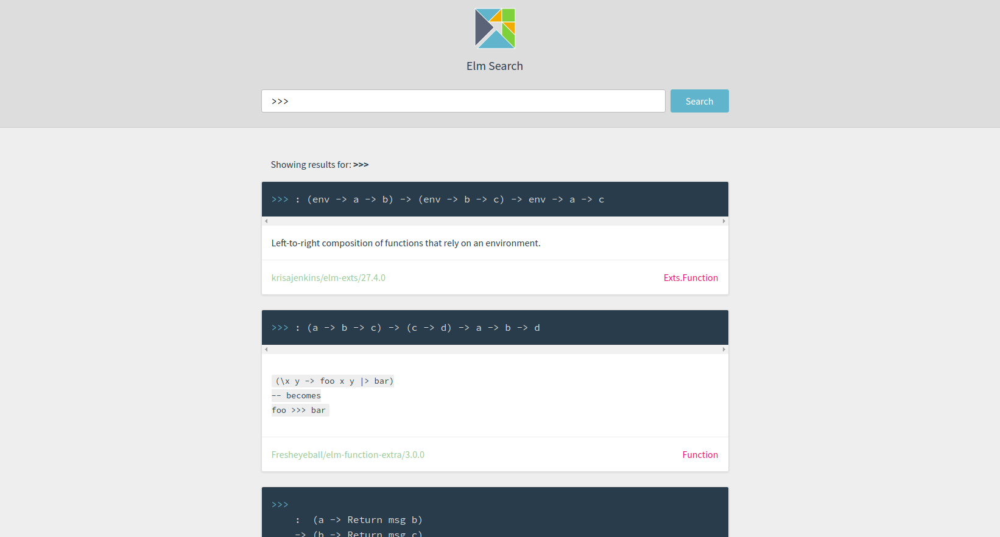
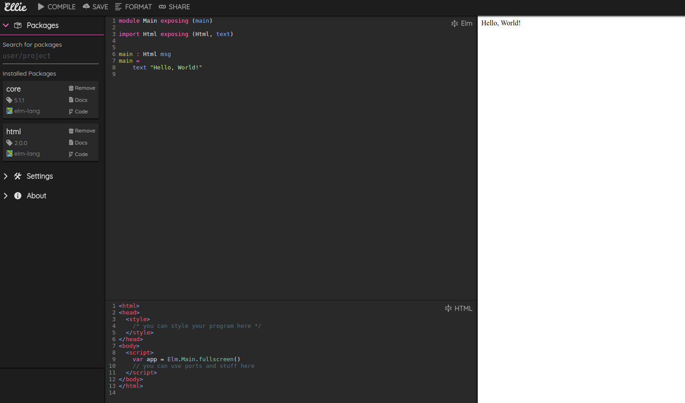
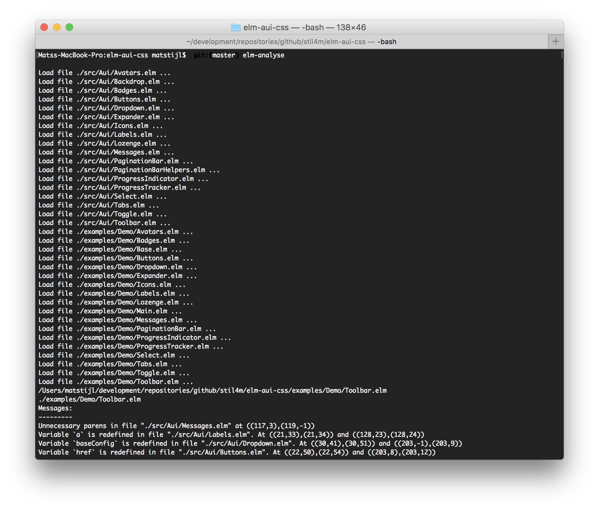
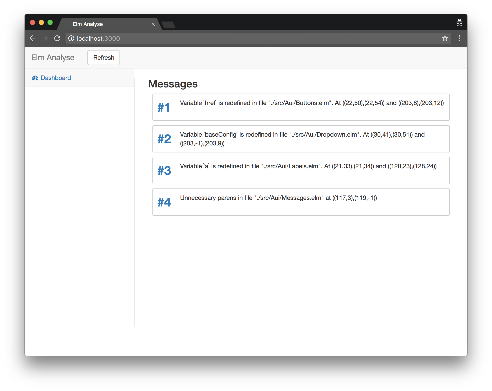
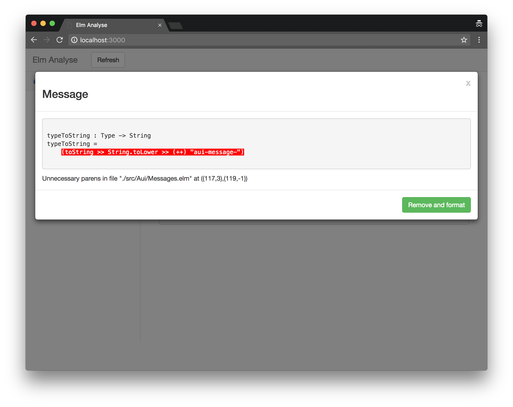

# Elm Tooling

**Libraries** and **tools** in the **Elm** ecosystem

---

## I'm Andy

Working at [Jambit](https://jambit.com)

Twitter: [_andys8](https://github.com/andys8)

Github: [andys8](https://github.com/andys8)

---

## Where to find libraries?

+++
Elm Packages

+++
Fancy Search


---

# Tooling

+++
JavaScript has great tooling.
+++
**Elm**, too!
+++

<table>
  <tr>
    <th><i>Tool</i></th>
    <th>Javascript</th>
    <th>Elm</th>
  </tr>
  <tr class="fragment">
    <td><i>Try online</i></td>
    <td>Codepen</td>
    <td>Ellie App</td>
  </tr>
  <tr class="fragment">
    <td><i>Starter</i></td>
    <td>Create React App</td>
    <td>Create Elm App</td>
  </tr>
  <tr class="fragment">
    <td><i>Formatter</i></td>
    <td>Prettier</td>
    <td>Elm Format</td>
  </tr>
  <tr class="fragment">
    <td><i>Linting</i></td>
    <td>Eslint</td>
    <td>Elm Analyse</td>
  </tr>
   <tr class="fragment">
    <td><i>Test</i></td>
    <td>Jest</td>
    <td>Elm (Html) Test</td>
  </tr>
   <tr class="fragment">
    <td><i>HTTP</i></td>
    <td>Axios</td>
    <td>Elm Http Builder</td>
  </tr>
</table>

---

## Ellie

> Elm Live Editor in the browser

* Share code
* Install packages
* Ported Elm compiler in the browser

+++



---

## Create Elm App

> Create Elm apps with no build configuration.

+++

```sh
npm install create-elm-app -g
create-elm-app my-app
```
+++

Get's you a bunch of features

* Elm platform
* Elm test
* Webpack
* Style loader
* Babel
* Autoprefixer

+++

You can eject

---

## Elm Format

> `elm-format` formats Elm source code according to a standard set of rules.

+++
Unformatted

```elm
module Main exposing(..)
import Html exposing(li,text,ul)
import Html.Attributes exposing(class)
main=ul[class"items"][li[][text"Chair"],li[][text"Table"],li[][text"Couch"]]
```
+++
Formatted

```elm
module Main exposing (..)

import Html exposing (li, text, ul)
import Html.Attributes exposing (class)


main =
    ul [ class "items" ]
        [ li [] [ text "Chair" ]
        , li [] [ text "Table" ]
        , li [] [ text "Couch" ]
        ]
```
---

## Elm Analyse

> A tool that allows you to analyse your Elm code, **identify deficiencies** and apply **best practices**.

+++



+++



+++



+++

### Rules

- Find unused variables, imports and code
- Duplicate imports
- Maximium Line Length
- Non Static Regex

---

## Elm Test

```elm
suite : Test
suite =
    describe "String.reverse"
        [ test "reverses a known string" <|
            \_ ->
                "ABCDEFG"
                    |> String.reverse
                    |> Expect.equal "GFEDCBA"
        ]
```

+++

### Fuzz Tests

Property based testing

```elm
suite : Test
suite =
    describe "String.reverse"
        [ fuzz string "identity if you run it twice" <|
            \randomString ->
                randomString
                    |> String.reverse
                    |> String.reverse
                    |> Expect.equal randomString
        ]
```

---

## Elm Html Test

> **Test views** by writing expectations about Html values.

+++

`view` is a **pure function** from `Model` to `Html`

+++

`view` is **easy** to test

+++

```elm
test "Button has the expected text" <|
    \_ ->
        Html.div [ class "container" ]
            [ Html.button [] [ Html.text "A button!" ] ]
            |> Query.fromHtml
            |> Query.find [ tag "button" ]
            |> Query.has [ text "B button!" ]
```

+++

```sh
↓ UI test
✗ Button has the expected text
▼ Query.fromHtml

    <div class="container">
        <button>
            A button!
        </button>
    </div>


▼ Query.find [ tag "button" ]

    1)  <button>
            A button!
        </button>

▼ Query.has [ text "B button!" ]
✗ has text "B button!"
```

+++

* Can search for children, attributes and styles
* Query single or multiple elements
* Simulate **events** like clicks

---

## Elm Http Builder

```elm
addItem : String -> Cmd Msg
addItem item =
    HttpBuilder.post "http://example.com/api/items"
        |> withQueryParams [ ("hello", "world") ]
        |> withHeader "X-My-Header" "Some Header Value"
        |> withJsonBody (itemEncoder item)
        |> withTimeout (10 * Time.second)
        |> withExpect (Http.expectJson itemsDecoder)
        |> withCredentials
        |> send handleRequestComplete
```

+++

* Simple API
* Can be tested easily

---

## Summary

- **Ellie App** to try elm online
- **Create Elm App** to get started
- **Elm Format** styles the code
- **Elm Analyse** checks it
- **Elm Test** and **Html Test** for testing
- **Elm Http Builder** to create requests

